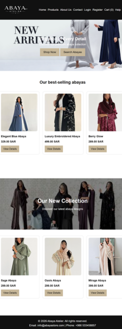
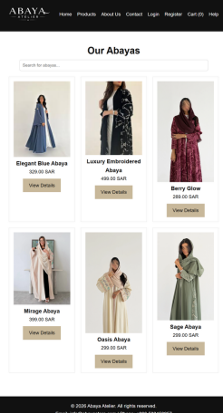
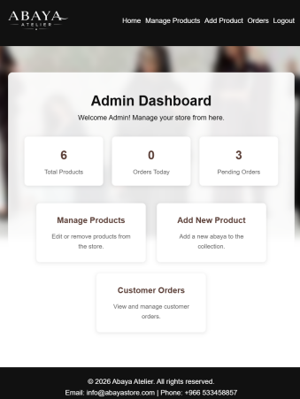

# Abaya Atelier

A web-based abaya shopping system developed using HTML, CSS, JavaScript, PHP, MySQL, and API integration.

## About the Project

Abaya Atelier is a university team project designed to provide a simple online shopping experience for abayas.

Users can browse products, view product details, search for abayas, create an account, log in, manage their shopping cart, and complete the checkout process.

The system also includes an admin section for managing products and viewing customer orders.

## Features

### User Features
- Browse abaya collections
- View product details
- Search for products
- User registration and login
- Shopping cart
- Checkout process
- Contact form
- Help and FAQ section

### Admin Features
- Admin login
- Admin dashboard
- Add and manage products
- View customer orders

## Technologies Used

- HTML
- CSS
- JavaScript
- PHP
- MySQL
- Fetch API
- External API integration

## Database

The project uses a MySQL database.

Database file:

`database/abaya_atelier-2.sql`

## Website Preview

  
  
  

## Project Type

University Web-Based Systems Team Project
